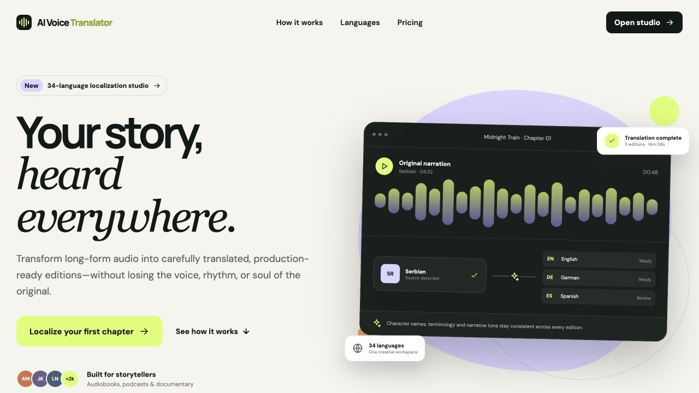
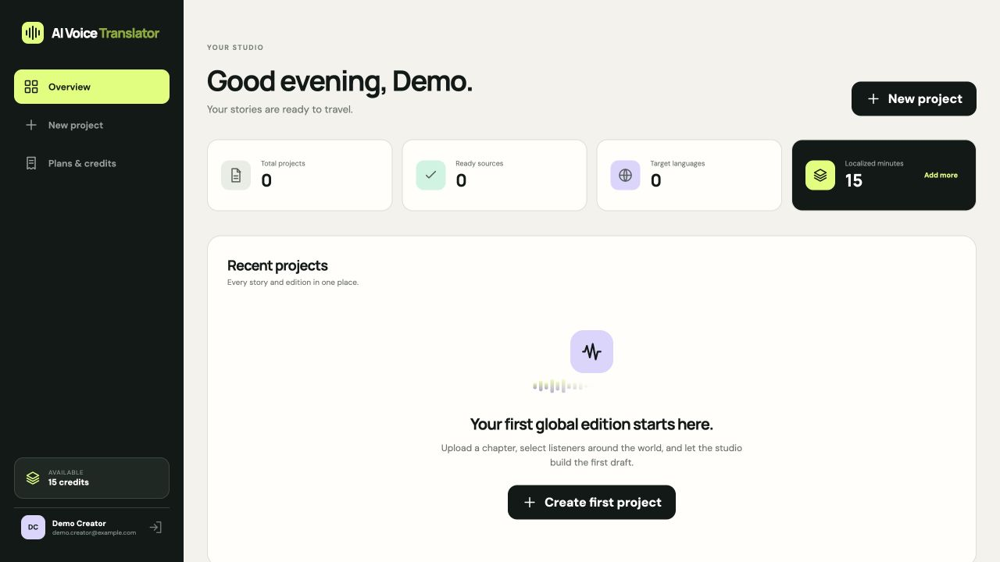
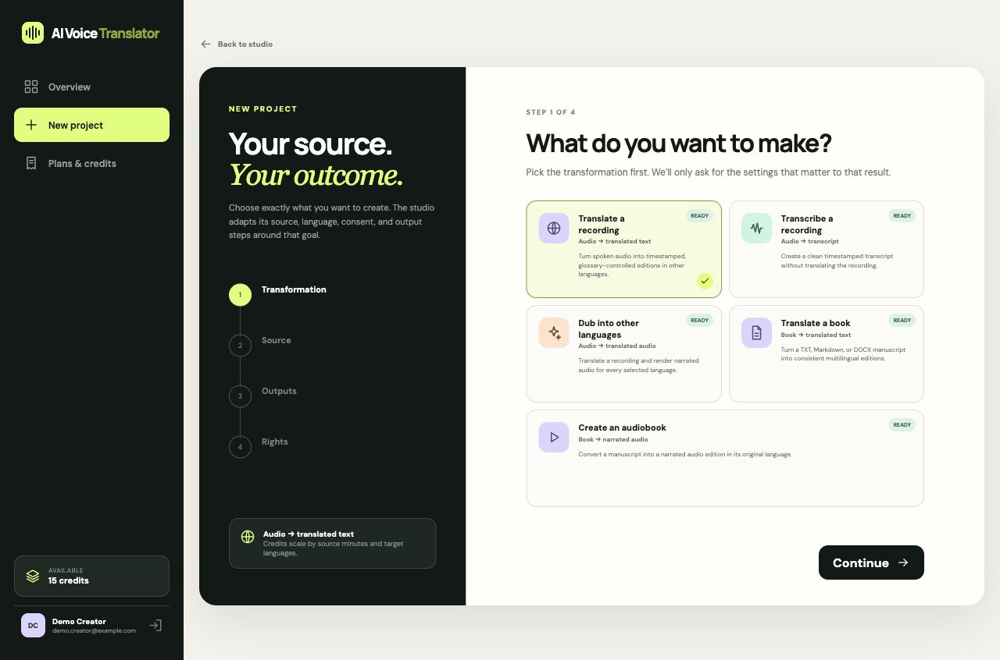
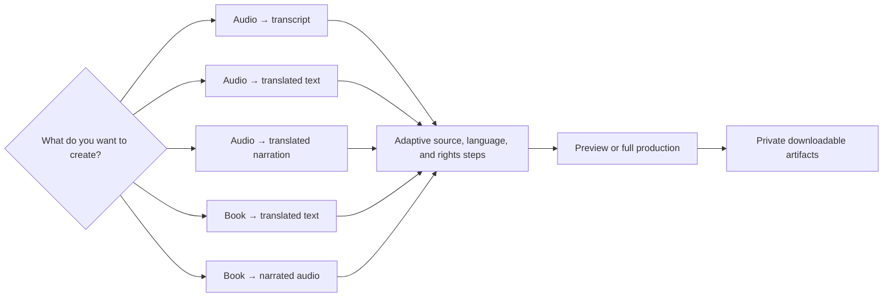
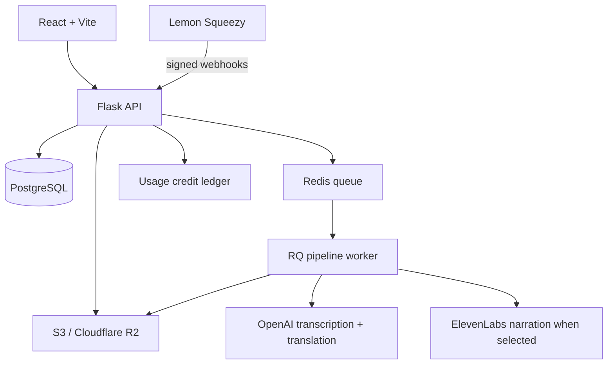

<p align="center">
  
</p>

<h1 align="center">AI Voice Translator</h1>

<p align="center">
  <strong>One source. Many possibilities.</strong><br />
  A creator-first SaaS workspace for turning books and recordings into
  transcripts, translations, narrated audio, and multilingual editions.
</p>

<p align="center">
  <a href="https://github.com/Djordje3002/audiobook_pipeline/actions/workflows/ci.yml"></a>
  
  
  
  
</p>

> [!IMPORTANT]
> This repository is a production-shaped **private-beta foundation**. The SaaS
> ships five creator-selected workflows. Text workflows require OpenAI;
> audiobook and translated-audio workflows additionally require configured
> ElevenLabs credentials and recorded voice authorization. “Dub” currently
> means translated AI narration—it does not preserve the original performance,
> timing, or vocal identity.

## The product

AI Voice Translator helps authors, publishers, podcasters, course creators, and
documentary teams start with the result they want instead of wrestling with a
generic pipeline. A creator can choose:

| Source | Transformation | Delivered output |
| --- | --- | --- |
| Recording | Transcribe | Timestamped source transcript |
| Recording | Translate | Transcript, glossary, and translated text editions |
| Recording | Create translated audio | Translated text plus AI-narrated MP3 per target language |
| TXT, Markdown, or DOCX book | Translate | Segmented source, glossary, and translated text editions |
| TXT, Markdown, or DOCX book | Create an audiobook | Segmented source plus AI-narrated MP3 |

Every project supports a five-minute preview and full production. The selected
workflow controls accepted files, required languages, consent, provider gates,
credit math, job routing, and downloadable artifacts.

<table>
  <tr>
    <td width="50%"></td>
    <td width="50%"></td>
  </tr>
  <tr>
    <td align="center"><sub>Public product experience</sub></td>
    <td align="center"><sub>Private organization workspace</sub></td>
  </tr>
</table>

<p align="center">
  
  <br />
  <sub>The project wizard starts with the creator’s intended outcome and adapts every later step.</sub>
</p>

## What is inside

| Product area | Included capability |
| --- | --- |
| Transformations | Five explicit book/audio workflows, 34-language catalog, timestamped transcription, literary translation, optional AI narration |
| SaaS workspace | Adaptive four-step project wizard, secure sessions, organizations, consent records, persistent jobs, activity, downloads |
| Usage and billing | Immutable credit ledger, reservation/refund flow, Free/Creator/Studio plans, Lemon Squeezy checkout and portal |
| Production runtime | PostgreSQL migrations, Redis/RQ workers, S3/R2 storage, per-job file isolation, safe temporary cleanup |
| Trust and safety | Rights and narrator-consent records, CSRF, rate limits, secure cookies, CSP/HSTS, signed replay-safe billing webhooks |
| Developer experience | React/Vite build, Flask app factory, typed domain model, CI, tests, deployment and launch runbooks |

## How it works



Every job reserves its full credit cost before dispatch. If processing fails,
the reservation is returned. Repeated job requests and billing events use
idempotency keys so retries do not create duplicate charges or credit grants.

## Architecture



Local development replaces PostgreSQL, Redis/RQ, and S3 with SQLite, a background
thread, and local storage. Production refuses to start with that development
topology.

For the domain model and design decisions, read
[the SaaS architecture](docs/SAAS_ARCHITECTURE.md).

## Technology

- **Frontend:** React 18, Vite 8, responsive custom CSS.
- **API:** Python 3.11, Flask, Flask-SQLAlchemy, Flask-Migrate.
- **AI:** OpenAI timestamped transcription and Responses API translation.
- **Voice:** Optional ElevenLabs multilingual text-to-speech for authorized
  audiobook and translated-audio workflows.
- **Jobs:** Redis and RQ, with an explicit local thread fallback.
- **Data:** PostgreSQL in production, SQLite in development.
- **Files:** S3-compatible storage, including Cloudflare R2.
- **Billing:** Lemon Squeezy checkout, customer portal, subscriptions, and
  HMAC-SHA256 webhook verification.
- **Audio:** FFmpeg, pydub, optional ElevenLabs/readback modules.

## Quick start

Prerequisites: Python 3.11, Node.js 22, FFmpeg, and `ffprobe`.

```bash
git clone https://github.com/Djordje3002/audiobook_pipeline.git
cd audiobook_pipeline

python3.11 -m venv .venv
source .venv/bin/activate
pip install -r requirements-dev.txt
npm ci --prefix frontend

cp .env.example .env
# Add OPENAI_API_KEY to .env
# Add ELEVENLABS_API_KEY and ELEVENLABS_VOICE_ID for narrated-audio workflows

flask --app app db upgrade
npm run build --prefix frontend
flask --app app run --host 127.0.0.1 --port 8080
```

Open [http://127.0.0.1:8080](http://127.0.0.1:8080), register an account, and
create the first project. Local mode supplies 15 signup credits and does not
require PostgreSQL, Redis, R2, or Lemon Squeezy.

For frontend hot reload, keep Flask on port `8080` and run:

```bash
npm run dev --prefix frontend
```

## Configuration

Copy `.env.example`; never commit the resulting `.env`.

| Group | Important variables |
| --- | --- |
| Application | `APP_ENV`, `APP_SECRET_KEY`, `APP_BASE_URL`, `FREE_CREDITS` |
| Database | `DATABASE_URL` |
| OpenAI | `OPENAI_API_KEY`, `OPENAI_TRANSLATION_MODEL`, `OPENAI_TRANSCRIPTION_MODEL` |
| Voice | `ELEVENLABS_API_KEY`, `ELEVENLABS_VOICE_ID`, `ELEVENLABS_MODEL_ID` |
| Jobs | `JOB_EXECUTION_MODE`, `REDIS_URL`, `RATELIMIT_STORAGE_URI` |
| Storage | `STORAGE_BACKEND`, `S3_ENDPOINT_URL`, `S3_BUCKET`, scoped S3 credentials |
| Billing | Lemon Squeezy API key, store ID, webhook secret, and plan variant IDs |

In production, startup validation requires HTTPS, a 32+ character application
secret, PostgreSQL, Redis/RQ, S3-compatible storage, OpenAI, configured billing,
secure cookies, and disabled legacy Basic Auth.

## Plans and metering

Single-output workflows use one credit per rounded source minute. Multilingual
workflows multiply that duration by the number of target languages:

```text
credit cost = rounded source minutes × max(1, number of target languages)
```

| Plan | Credits | Product default |
| --- | ---: | ---: |
| Free | 15 once | $0 |
| Creator | 300 / payment | $29 / month |
| Studio | 1,200 / payment | $79 / month |

These are private-beta defaults, not validated public pricing. Measure provider
cost, gross margin, quality, and willingness to pay before a public launch.

## Test and build

```bash
pytest -q
npm run build --prefix frontend
npm audit --prefix frontend
pip check
```

The GitHub Actions workflow runs backend tests and a production frontend build on
every push and pull request to `main`.

## Production deployment

The recommended topology uses two services built from the same repository:

```bash
# web
gunicorn app:app --timeout 120 --workers 1 --worker-class gthread --threads 4 --bind 0.0.0.0:$PORT

# worker
rq worker --url "$REDIS_URL" pipeline

# pre-deploy migration
flask --app app db upgrade
```

Follow the complete [Railway deployment runbook](docs/DEPLOYMENT.md), then close
every relevant gate in the [public launch checklist](docs/LAUNCH_CHECKLIST.md).

## Repository map

```text
frontend/       React/Vite marketing site and product studio
saas/           accounts, projects, billing, jobs, credits, storage
modules/        transcription, translation, synthesis, audio processing
migrations/     Alembic schema history
tests/          HTTP, SaaS API, billing, and pipeline utility tests
docs/           architecture, deployment, launch, and repository visuals
```

## Responsible use

Only process books, recordings, and voices you are authorized to use. Every
project records content rights; workflows that synthesize audio additionally
record explicit voice authorization. Those records are not a replacement for
legal review, provider verification, or jurisdiction-specific consent
requirements.

Before serving public users, implement the remaining email verification,
password reset, file scanning, retention/deletion, support, and legal-policy
gates documented in the launch checklist.

## Contributing and security

Contributions are welcome through focused issues and pull requests. Start with
[CONTRIBUTING.md](CONTRIBUTING.md). For security vulnerabilities, follow
[SECURITY.md](SECURITY.md) and use GitHub's private reporting channel rather than
opening a public issue.

---

<p align="center">
  Built for stories that deserve more than one possible form.
</p>
